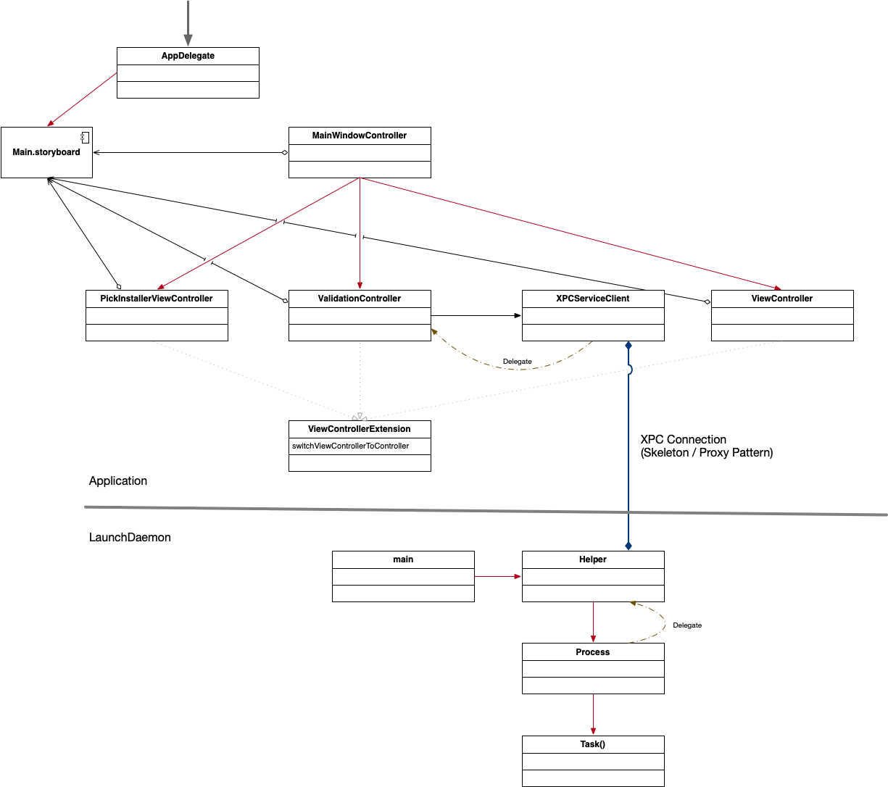
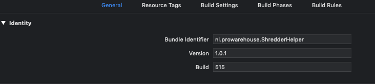
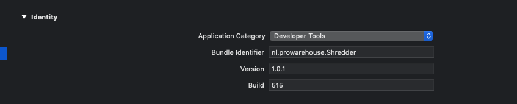
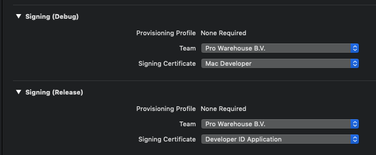

# Developer Note

Description 
===================================

- This document is a note to help developers do a checkout and get the code building, signed and running.
- There are a number of steps you will have to take. Due to the nature of this application it is not a matter of checkout and run.
- The project uses [SwiftLint](https://github.com/realm/SwiftLint) to validate the code.

Requirements
===================================

- Xcode 11 or higher
- Swift 5

Architecture
===================================

The project consists of two targets: 

- Shredder (macOS Application)
- nl.prowarehouse.ShredderHelper (commandline tool)

The reasoning for the two targets is that we need to execute the command "startosinstall" with elevated rights. i.e. with sudo rights. 
However when we would run this command from within the app, the command is executed under same priveleges as the user that is logged in. 
In order to be able to execute the command with elevated permissions we need to use a launchDaemon. A launchDaemon is executed with root permissions. Now we face with the challange how to communicate with the daemon. 

There is a service in the macOS SDK that helps with this challange. XPCService. ( [More Information on XPCService](https://developer.apple.com/library/archive/documentation/MacOSX/Conceptual/BPSystemStartup/Chapters/CreatingXPCServices.html) ) 

Although this documenation of Apple is no longer being updated it still contains enough information to understand the principles at hand, however the documentation is more focussed around Objective-C. The primary patterns used in this service are Proxy & Skeleton.

Signing
===================================

Due to the secure nature of macOS, it is not permitted that any launch daemon can communicate with any application. 
We need a way to ensure that only our daemon communicates with the application and vice-versa. The signature of the certificate that signed the application is used to verify and allow the communication between the helper and app. Apple has provided a python script that enters the signature of the build app in the Info.plist of both the helper and application. In the folder **Util** you will find `SMJobBlessTool.py`

However in order to be able to sign both targets successfully, you need to take some steps in the Developer Portal and make some changes in the project.

1. Create a Production Certificate (Developer ID Application).
2. Create a Development Certificate for Mac Development.
3. Install both certicates and private keys in the keychain of your choice.
4. Change the Bundle Identifier of the helper to one fitting for your organisation. 
5. Change the Bundle Identifier of the main app to one fitting for your organisation. 
6. Make sure that your Signing settimgs are set correctly for your certificates & team. 
7. Change the name of the helper target and you also need to change a piece of code: Line 54 of the XPCService.swift file. We have placed a warning macro here as well.

It is not possible to use the Automated Signing from within Xcode. Due to the signature matching between helper and app.

Using SMJobBlessUtil.py to set the signature.
===================================

When you want to either create a debug or a release build you first need to create a build of the desired config, next use this build as input for the SMJobBlessUtil.py

`Util/SMJobBlessUtil.py setreq <path to build> <path to App Info.plist> <path to Helper Info.plist>`

After using the bless tool, you need to build again to use the build.

You can also use the tool to validate the signature by using the flag 'check'.

`Util/SMJobBlessUtil.py check <path to build>`
	

Target 'BuildBlessDebug'
===================================

The target is created to help with the preparing the source for the building and signing the Debug build. This target follows the rythem explained in 'Using SMJobBlessUtil.py to set the signature.' section. 

The script uses set values to use the bless util to add the correct signature to the info plists. When you change names of the application and or names of these plist files, you need to update the script as well.

License
===================================
Copyright ©2018 Pro Warehouse.

Permission is hereby granted, free of charge, to any person obtaining a copy
of this software and associated documentation files (the "Software"), to deal
in the Software without restriction, including without limitation the rights
to use, copy, modify, merge, publish, distribute, sublicense, and/or sell
copies of the Software, and to permit persons to whom the Software is
furnished to do so, subject to the following conditions:

The above copyright notice and this permission notice shall be included in all
copies or substantial portions of the Software.

THE SOFTWARE IS PROVIDED "AS IS", WITHOUT WARRANTY OF ANY KIND, EXPRESS OR
IMPLIED, INCLUDING BUT NOT LIMITED TO THE WARRANTIES OF MERCHANTABILITY,
FITNESS FOR A PARTICULAR PURPOSE AND NONINFRINGEMENT. IN NO EVENT SHALL THE
AUTHORS OR COPYRIGHT HOLDERS BE LIABLE FOR ANY CLAIM, DAMAGES OR OTHER
LIABILITY, WHETHER IN AN ACTION OF CONTRACT, TORT OR OTHERWISE, ARISING FROM,
OUT OF OR IN CONNECTION WITH THE SOFTWARE OR THE USE OR OTHER DEALINGS IN THE
SOFTWARE.

